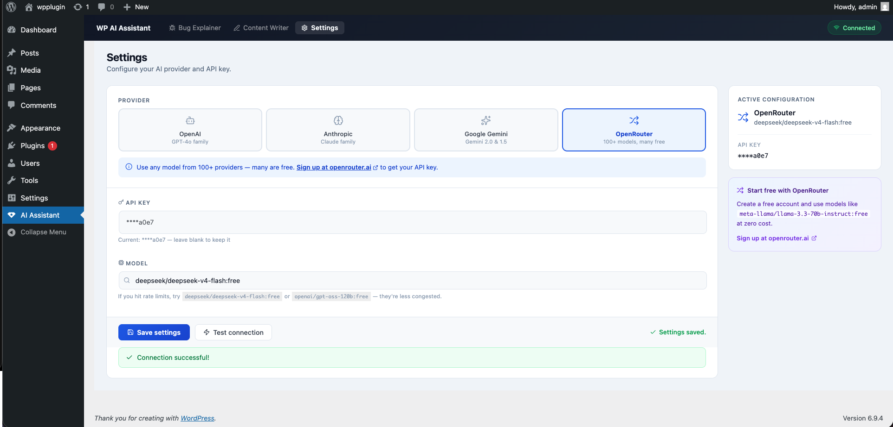
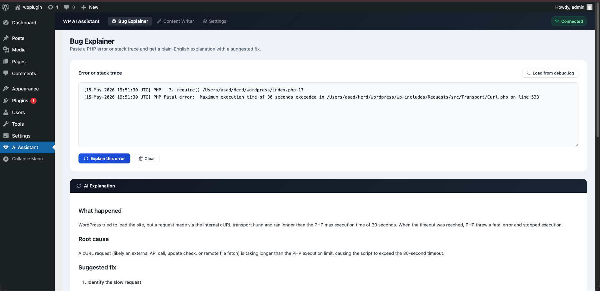
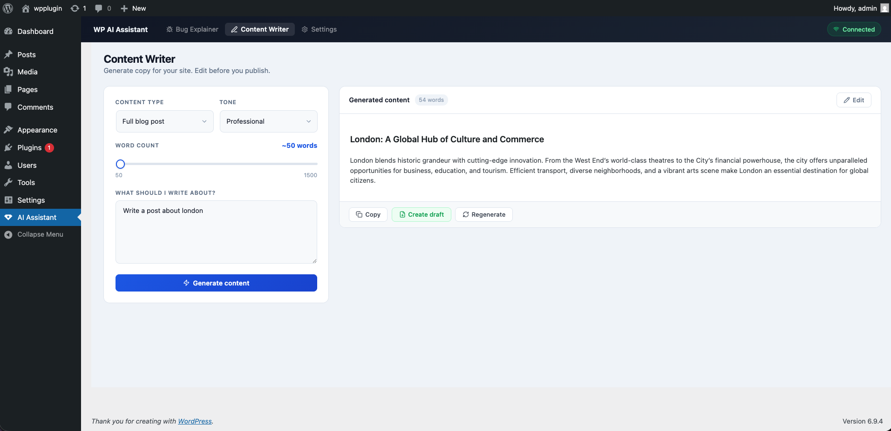

# WP AI Assistant

AI-powered bug explainer and content writer for your WordPress admin. Bring your own API key — supports OpenAI, Anthropic, Google Gemini, and OpenRouter (100+ models, many free).

---

## Screenshots

| Bug Explainer | Content Writer | Settings |
|---|---|---|
|  |  |  |

---

## Features

**Bug Explainer**
- Paste any PHP error or stack trace and get a plain-English explanation with a suggested code fix
- Load errors directly from `wp-content/debug.log` with one click
- Syntax-highlighted code blocks with a copy button

**Content Writer**
- Generate blog posts, product descriptions, social captions, page intros, and email newsletters
- Choose content type, tone, and target word count
- Preview the result, edit it in-browser, and publish as a WordPress draft in one click

**Supported AI Providers**
- **OpenAI** — GPT-4o, GPT-4o mini, GPT-4 Turbo
- **Anthropic** — Claude Sonnet, Haiku, Opus
- **Google Gemini** — Gemini 2.0 Flash, 1.5 Pro, 1.5 Flash
- **OpenRouter** — 100+ models from multiple providers, many completely free (Llama, DeepSeek, Gemma, Qwen and more)

---

## Installation

1. [Download the latest ZIP](https://github.com/CybertronianKelvin/wp-ai-assistant/releases/latest/download/wp-ai-assistant.zip)
2. Go to **Plugins → Add New → Upload Plugin** in your WordPress admin
3. Upload the ZIP and activate
4. Go to **AI Assistant** in the admin sidebar → **Settings**
5. Enter your API key, choose your provider and model, then save

### Getting a Free API Key

- **OpenRouter (recommended)** — Sign up at [openrouter.ai](https://openrouter.ai). Many models are completely free with no credit card required
- **Google Gemini** — Free key at [aistudio.google.com](https://aistudio.google.com)
- **OpenAI** — [platform.openai.com/api-keys](https://platform.openai.com/api-keys)
- **Anthropic** — [console.anthropic.com](https://console.anthropic.com)

---

## Requirements

- WordPress 6.0+
- PHP 8.0+ (8.1+ recommended)

## Privacy

API requests go directly from your WordPress server to the AI provider you choose. No data passes through any proxy or middleware. Your API key is stored only in your WordPress database.

## License

GPL-2.0-or-later — see [LICENSE](https://www.gnu.org/licenses/gpl-2.0.html)
